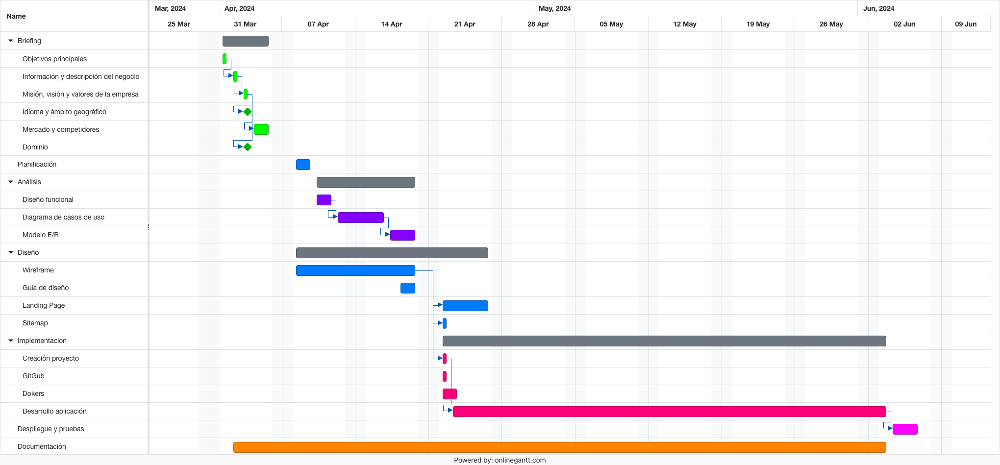
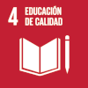
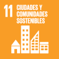
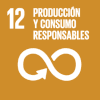
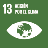

# Introducción

Esta aplicación parte de la idea de que un juego puede tener distintas vidas de uso, o más concretamente, con el principio de que distintas personas puedan utilizar de un mismo juego. Por este motivo, se ha desarrollado una aplicación que proporciona una plataforma donde se puede ofrecer un juego propio, con idea de localizar a alguien que pueda estar interesado en él, de forma que se pueda alcanzar un acuerdo de intercambio. Esta aplicación permite localizar juegos a través de distintos criterios de búsqueda. Uno de los elementos más relevante de la aplicación es la posibilidad de gestión de los productos propios, así como los juegos de aquellas personas potenciales con las que se puede llegar a un acuerdo.

Por otra parte, la posibilidad de acercar los juegos a aquellas personas que tienen menos posibilidades económicas o acceso, se plantea la posibilidad de proporcionar un espacio donde se puedan dar donaciones de juegos a los que ya no se le da uso o, incluso, la posibilidad de dar aportaciones económicas para campañas de recogida de fondos para la compra de juguetes.

Se desarrolla la aplicación atendiendo a la perspectiva de poder ser utilizada en distintos tipos de dispositivos, por lo que se desarrollará mediante un diseño responsive, y en la medida de lo posible, mediante la utilización de frontend adaptado a dispositivos móviles.	

Aunque esta aplicación, se ha planteado a partir del intercambio de juguetes entre particulares, se puede extrapolar a distintos tipos de productos.  

## Datos del proyecto

| Nombra | Apellidos | Título | Ciclo | Año |  Centro |
| --- | --- | --- | --- | --- | --- |
| Javier | García Montero | Changame _(Change Game)_ | CFGS DAW| 2023-2024| I.E.S. Virgen del Carmen|

## Planificación
### Diagrama de Gantt
Se muestra la planificación del proyecto mediante diagrama de Gantt

### Planificación semanal del proyecto

**Semana del 1 al 7 de marzo** 

* Organización del trabajo. Se definen cinco líneas de trabajo. 
  1.	El análisis funcional y recopilación de los contenidos.
  2.	Definición de diseño e interfaz gráfica
  3.	Desarrollo de la aplicación
  4.	Elaboración de la documentación
* Ideas iniciales (SCRUM)
  1.	Seguimiento semanal de avance
  2.	Evaluación de dificultades encontradas
  3.	Adaptación funcional atendiendo a las dificultades encontradas
  4.	Reevaluación funcional de aplicación
  5.	Reunión tutor cada 15 días 
* Elementos del proyecto 
  1.	Software
  2.	Documentación (memoria)
  3.	Presentación 
* Preparación de la plantilla del documento
  
**Semana del 8 al 14 de abril**

* Título. Changame (_Change Game_)
* Definición de los objetivos iniciales
* Breve resumen 
  * Abstract
  * Introducción
* Investigación de estudios y proyectos similares (estado del arte)

**Semana del 15 al 21 de abril**

* Investigación de estudios y proyectos similares (estado del arte) [D]
* Introducción [D]
* Objetivos definitivos [D] - exactamente qué estamos haciendo
* Material y recursos a utilizar [D]

**Semana del 22 al 28 de abril** 

* Métodos seguidos en el proceso, metodologías, tecnologías (justificación)
* Desarrollo de modelo gráfico funcional (páginas web de contenido)
* Formación y definición del proyecto
 
**Semana del 29 de abril al 5 de mayo**

* Resultados iniciales (“bocetos” del programa).
* Verificación y Visto Bueno.
* Analizar si hace falta cambiar algo de los requisitos o tecnologías inicialmente planificadas y explicar si hay algún cambio porqué se ha hecho [D]

**Semana del 6 al 19 de mayo** 

* Resultados intermedios (demo funcional)
* Primera revisión de la documentación para ver que estén todos los puntos necesarios 

**Semana del 20 al 26 de mayo**

* Resultados finales (proyecto terminado: tutorial, aplicación…) 
* Segunda revisión del documento [todos los apartados] 
* Preparación de la presentación 

**Semana del 27 de mayo al 9 de junio**
    
* Pulimos los posibles “bugs”
* Entrega del documento final 

**Semana del 12 al 14 de junio**  

* Organización de la presentación
* Entrega de la presentación para la exposición 
* Presentación de proyectos

## Objetivos generales

Intercambiar juegos puede tener una serie de ventajas tanto para los jóvenes como para sus familias y el medio ambiente. 

* **Variedad de experiencia de juego**: Intercambiar juegos permite a los jugadores acceder a una amplia variedad de juegos sin tener que gastar grandes sumas de dinero en comprarlos todos. Esto les brinda la oportunidad de probar diferentes estilos de juegos, géneros y mecánicas de juego.

* **Fomenta la colaboración y la competencia amistosa**: Al intercambiar juegos, los jugadores pueden reunirse para jugar juntos, lo que fomenta la colaboración, la cooperación y la construcción de relaciones sociales positivas. También pueden competir de manera amistosa en los juegos intercambiados, lo que promueve habilidades de resolución de problemas y pensamiento estratégico.

*	**Ahorro de dinero**: Intercambiar juegos es una forma económica de expandir la biblioteca de juegos de uno sin tener que comprarlos nuevos. Esto es especialmente útil dado el costo relativamente alto de muchos juegos de mesa y videojuegos.

*	**Renovación de la experiencia de juego**: Intercambiar juegos usados puede brindar a los jugadores una forma de renovar su experiencia de juego al obtener juegos nuevos para ellos sin tener que gastar dinero adicional.

* **Promueve la sostenibilidad**: Al intercambiar juegos, se fomenta la reutilización y el reciclaje de juegos usados en lugar de desecharlos. Esto ayuda a reducir el desperdicio y promueve prácticas más sostenibles.

* **Exploración de nuevos intereses**: Intercambiar juegos puede permitir a los jugadores explorar nuevos intereses y géneros de juegos que de otra manera no habrían considerado comprar.

En resumen, intercambiar juegos puede ser una forma emocionante y económica de expandir la colección de juegos de uno, mientras fomenta la socialización, la diversidad de experiencias de juego y prácticas más sostenibles.

Otro aspecto a tener en cuenta es que se desarrollan Objetivos de Desarrollo Sostenible (ODS) diseñados para ser un «plan para lograr un futuro mejor y más sostenible para todos». Los ODS que se abordan en este proyecto van encaminados a los siguientes objetivos.

* [ODS 4](https://www.un.org/sustainabledevelopment/es/education/): _"Garantizar una educación inclusiva, equitativa y de calidad y promover oportunidades de aprendizaje durante toda la vida para todos"_ 
* [ODS 11](https://www.un.org/sustainabledevelopment/es/cities/): _"Lograr que las ciudades sean más inclusivas, seguras, resilientes y sostenibles"_
* [ODS 12](https://www.un.org/sustainabledevelopment/es/sustainable-consumption-production/): _"Garantizar modalidades de consumo y producción sostenibles"_
* [ODS 13](https://www.un.org/sustainabledevelopment/es/climate-change-2/): _"Adoptar medidas urgentes para combatir el cambio climático y sus efectos"_

&nbsp; 

\begingroup
  \centering 

&nbsp;
&nbsp;
&nbsp;
&nbsp;

\endgroup

## Elementos del proyecto 

En este proyecto se pretende generar una aplicación web funcional, que contiene un landing page de negocio. La documentación del proyecto conlleva una documentación completa de las distintas fases que se han llevado a cabo en el desarrollo de la aplicación web. Este documentación supondrá la memoria del proyecto.

Además, se aporta una presentación explicativa del desarrollo del proyecto. y un video explicativa del funcionamiento de la aplicación. 

## Estado de Arte

Investigación de estudios y proyectos similares

- https://ludonix.ch/es-ES/juegos/juegos-de-mesa/89
- https://www.kidalos.com/
- https://www.apli.com/es/juegos/juegos-de-mesa
- https://www.bigbuy.eu/

## Público objetivo

La amplicación está diseña para ser utilizad dentro del ámbito nacional. Por tanto no es multiidioma, aunque intertamente se ha definido el texto prácticamente en su totalidad, con idioma inglés, empleado archivos de configuración de idioma _"es.json"_ para su traducción a español. 

El dominio que se puede utilizar para el despliegue de la aplicación puede ser _chargame.es_ o _chargame.com_ (dominios disponibles actualmente). Por tanto, y puesto que se trata de una herramienta de ayuda que permita contactar con gente para realizar un trueque de productos propios, el **público objetivo** está enfocado en personas que se encuentren próximos dentro de un ámbito geográfico.

