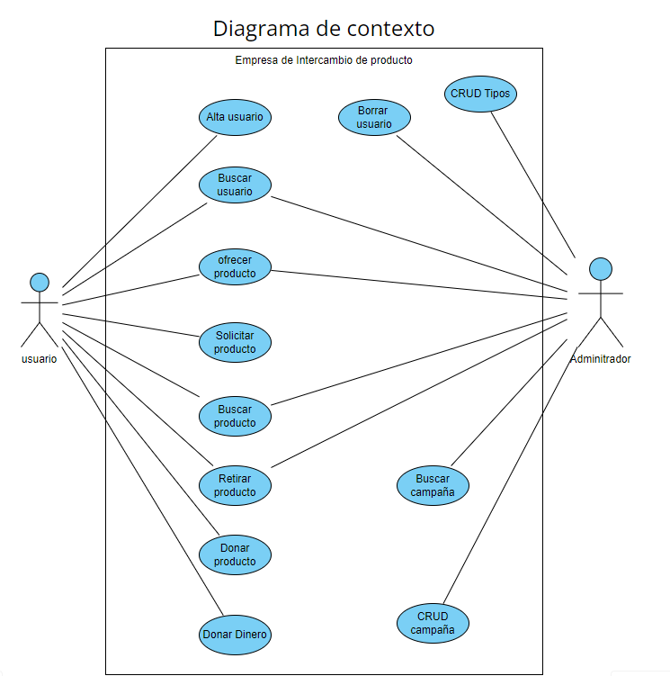

# Análisis

## Descripción funcional de la aplicación

Existen dos roles, un rol de administración y de usuario.
De un usuario se tiene la siguiente información: id, email, nickname, nombre, apellidos, teléfono, país, código postal, imagen. Un usuario puede ofrecer uno o muchos juegos. Cuando se ofrece un juego se almacena la fecha y hora.

Del juego se almacenará el código, nombre, descripción, año, estado, edad
recomendada, tipo, idioma, número de jugadores, tiempo juego, dificultad, marca. Un juego puede ser al menos de un tipo (categoría). Cada juego es de una marca. De un juego se almacena al menos 1 imagen y máximo 3.

Además, un juego debe tener almacenado, al menos una categoría (tipo). De las
categorías se almacena el código. Todos los juguetes disponibles pueden ser vistos por todos, a través de filtros por categorías y atributos. También se puede consultar por localidad extraída del código postal del usuario. No dirección exacta por privacidad. 

Todos los juegos disponibles son visibles por todos. Hasta que el usuario no suba un juego no puede optar a cambiar un juego ni mostrar interés por otro. Un usuario puede estar interesado en uno o más juegos (distintos al suyo). Cuando se interesa por un juego, el usuario tiene que haberse identificado y por tanto dato de alta.   

Un usuario puede consultar el listado de los juegos de los que tiene interés.

Un usuario puede consultar el listado de sus juegos. En el listado se muestra si alguien tiene interés. Cuando alguien está interesado en un juego de un usuario, ese usuario puede consultar la lista de interesados y por ende sus productos.

Si hay interés mutuo, es decir, un usuario está interesado en un juego de un usuario que tiene interés en un juego del primero, se hace acuerdo.

El acuerdo retira de la lista de disponibles, los productos acordados. De los acuerdos, se guarda producto propio, producto ajeno y código de interesado. Además, permite activar el chat. El acuerdo se puede cerrar o desestimar. Ambas partes deben cerrar el acuerdo, con que desestime uno se rompe el acuerdo. Si no hay acuerdo, los productos vuelven a la lista de juegos disponibles, aunque siguen en lista de interés, el usuario decide si quiere mantener el interés. Se pueden consultar la lista de acuerdos, filtrando por cerrados o pendientes. También se pueden archivar los acuerdos cerrados. Si se archiva un acuerdo, se oculta y se muestra en un listado aparte (acuerdos archivados).

El administrador crea campañas, cada campaña tendrá una duración determinada, una campaña puede ser para recogida de dinero y/o recogida de juguetes. De la campaña se almacena el cóidigo, un nombre, descripción, fecha y fin, tipo de campaña (recogida de juguetes y/o dinero). Un usuario puede donar un o más juguetes en una campaña.

Una campaña de recogida puede tener asociado uno o más juguetes de la lista de
disponibles, un juguete no puede estar en más de una campaña. El usuario decide si quiere donar un juguete de la lista, cuando se marca para donar, se quita de la lista de disponible. 

La campaña de recogida incluye o no servicio de recogida. Una campaña de recogida de dinero se hará mediante aportación económica en una fecha de usuarios, mediante una forma de pago (bizum, tarjeta, transferencia) un importe. Un usuario puede hacer más de una aportación para una campaña de recogida de dinero y una campaña puede tener aportaciones de múltiples usuarios. No se requiere el almacenamiento de la tarjeta de crédito.

## Diagramas UML

### Diagrama de contexto

Un Diagrama de Contexto de Sistema en Ingeniería de software e Ingeniería de sistemas es un diagrama que define los límites entre el sistema, o parte del sistema, y su ambiente, mostrando las entidades que interactúan con él.​ 
  

### Casos de uso

Casos de uso General

