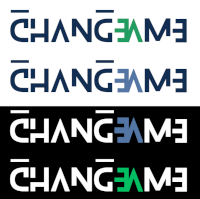
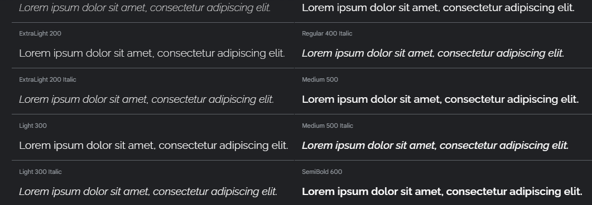
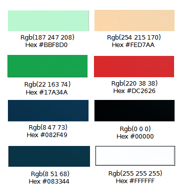
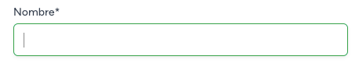

# Diseño

## Modelo Entidad/Relación (E/R)
Representa el modelo de datos de forma independiente del DBMS que se utilizará.

## Modelo Relacional

Esquema canónico (o de base de datos). Representa los datos en un formato más
cercano al del ordenador (Modelo lógico)

## Patrón de arquitectura MVC  (Modelo-Vista-Controlador)

Modelo-vista-controlador (MVC) es un patrón de arquitectura de software, que separa los datos y principalmente lo que es la lógica de negocio de una aplicación de su representación y el módulo encargado de gestionar los eventos y las comunicaciones. Para ello MVC propone la construcción de tres componentes distintos que son el modelo, la vista y el controlador; es decir: por un lado define componentes para la representación de la información y, por otro lado, para la interacción del usuario.

Por tanto se ha definido una estructura de contenidos basado en dicho modelo, donde se establece la siguiente estructura de carpetas:

  1. Vista
  2. Modelo
  3. Controllador
  4. Interfaz
  5. Factory

## Componentes de Interfaz

Para la interfaz de la aplicación se han tenido en cuenta los siguientes elementos de diseño.

### Elementos de Identificación
Los elementos de identificación se obtienen a partir de los elementos de navegación, o por acceso a contenido que requiere la autentificación del usuario. En este caso se accede a una nueva venta de verificación de usuario. Además, este debe permitir la recuperación/actualización de la contraseña en el caso de no ser recordada. 
Se añade a este elemento, la posibilidad de acceso a través de una cuenta usuario de Google+.

### Elementos de Navegación
Los elementos de navegación son los que nos permiten acceder a todos los contenidos que se encuentran en las diferentes páginas de un sitio Web. Pero, lo que no hemos dicho, es que si queremos que nuestra página sea usable, el usuario debe conseguir navegar por la página sin perderse y sin tener la sensación de perderse. Para conseguirlo, el sistema de navegación debería constar de una serie de elementos:

- Elemento de regreso a la portada. 
- Menú de secciones y/o áreas de interés.
- Información sobre la ubicación del usuario dentro del sitio Web.

Es importante para el usuario tener algún elemento que le permita volver al principio sin necesidad de utilizar la herramienta “ir hacia atrás o
regresar” del navegador. Este problema suele resolverse empleando un enlace en el __logotipo de la empresa__ que se sitúa normalmente en parte
superior izquierda de cada una de las páginas que componen el sitio Web.

### Elementos de Contenidos e Interacción
El contenido es la parte esencial de una página Web. Es importante que los  contenidos estén expresados en un lenguaje claro y conciso y, presentados en un formato agradable y de fácil lectura. Además, si el sitio Web está formado por muchas páginas, el contenido debe situarse siempre en la misma ubicación. También es importante evitar que el usuario tenga que hacer grandes desplazamientos durante la lectura de los contenidos. Siempre es mejor dividir el contenido en más de una página y enlazar unas con otras. 

la zona de contenido que a su vez se divide en dos zonas enmarcadas con elipses: el Título del contenido y el Contenido propiamente dicho.

## Guías de estilo

### Logotipo

### Favicon

### Tipografía

Google Fonts [RaelWay](https://fonts.google.com/specimen/Raleway)

### Colores

Con el fin de proporcionar contraste en la visualizació de los elementos, se ha optado por utilizar colores complementarios, análogos y monocromáticos. Paleta de colores empleado en los distintos elementos de la página web se puede ver en la siguiente imagen.

### Botones

### Input

### iconos utilizados

